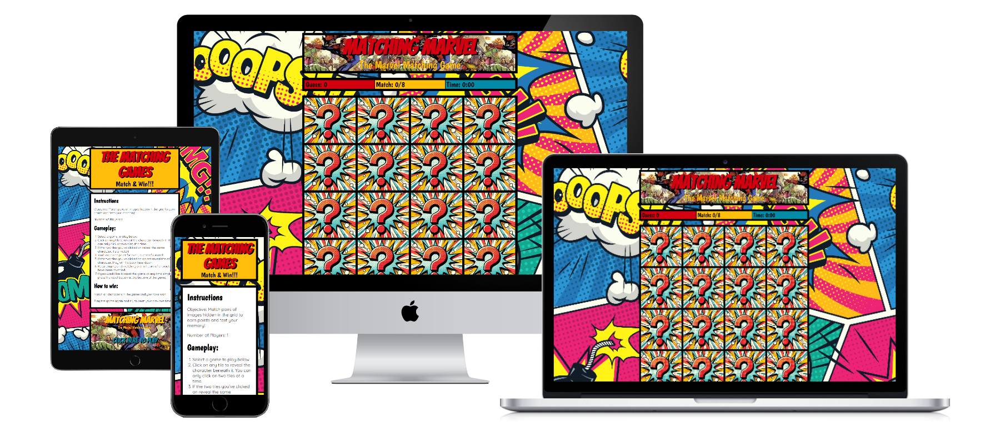
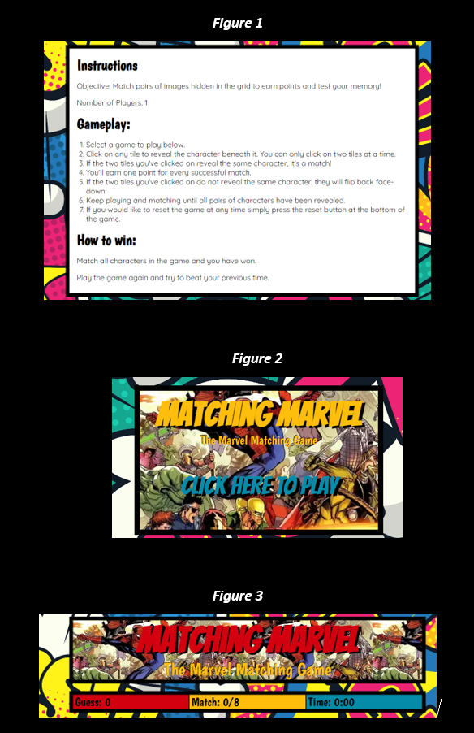
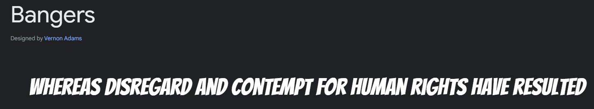
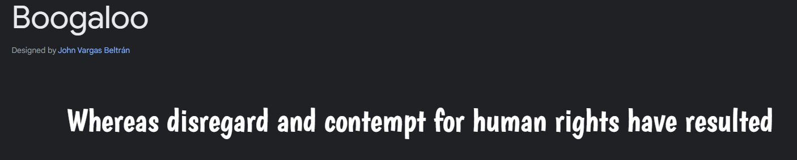
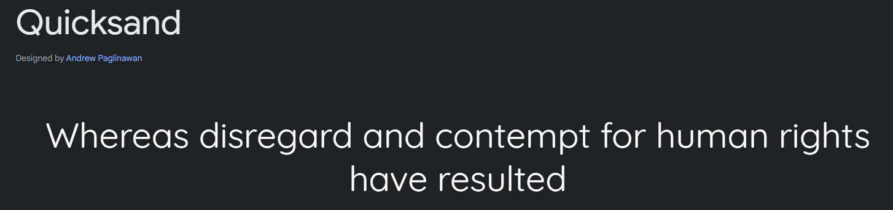

# The Matching Games
Welcome to "The Matching Games", the home of matching games! "The Matching Games" is a home for picture matching games that not only provides hours of entertainment but also enhances cognitive skills and memory in a fun and interactive way. Whether you're a young explorer seeking adventure or a parent looking for an engaging and educational activity for your child, this game is made to bring joy and excitement to players of all ages. 

                                                                     

                        

[Click here to view live website](https://chris-rg1980.github.io/code-institute-MSP2/)   
***
**Contents**
- [The Matching Games](#the-matching-games)
  - [User Stories](#user-stories)
    - [New User](#new-user)
    - [Returning User](#returning-user)
  - [Features](#features)
    - [Existing Features](#existing-features)
    - [Future Features](#future-features)
  - [Wire-frames](#wire-frames)
  - [Initial Design Concept](#initial-design-concept)
  - [UX Design](#ux-design)
    - [Intuitive Gameplay](#intuitive-gameplay)
    - [Simple User Interface](#simple-user-interface)
    - [Typography](#typography)
    - [Colour Scheme](#colour-scheme)
    - [Interactive Elements](#interactive-elements)
    - [Visual Feedback](#visual-feedback)
    - [Progress Tracking](#progress-tracking)
    - [Responsive Design](#responsive-design)
  - [Technology](#technology)
    - [Languages  Used](#languages--used)
    - [Frameworks](#frameworks)
    - [Libraries](#libraries)
    - [Utilities Used](#utilities-used)
  - [Testing](#testing)
  - [Deployment](#deployment)
    - [Initial deployment setup](#initial-deployment-setup)
    - [Releases](#releases)
    - [Forking the Repository](#forking-the-repository)
    - [Cloning the Forked Repository](#cloning-the-forked-repository)
    - [Cloning with Git](#cloning-with-git)
    - [Setting up Jest testing environment](#setting-up-jest-testing-environment)
  - [Credits](#credits)
    - [Code](#code)
    - [Images](#images)
    - [Other Credits](#other-credits)
    - [Thank You](#thank-you)
***
## User Stories
### New User
1.	I would like to see how fast I can complete the game.
2.	I would like to know how many moves it took me to complete the game.
3.	I would like to know how to play the picture matching games.

### Returning User
1.	I would like to be able to reset the game and aim for faster times.
2.	I would like to see if I can complete the game with less moves. 
3.  I would like to be able to play the game across on different devices. 
***
## Features
Within the game I have used Object-Oriented Programming (OOP) so that the game can accept different data sets to have different themes per game. This means that the game is structured around objects, which are instances of classes that contain data and methods. The use of OOP allows for greater flexibility and modularity in the code, making it easier to unit test, extend existing features or add new ones and for other developers to pick up core functionality. By accepting different data sets, the game can be customized to suit different themes, such as sports, animals, or movies. This makes it more engaging and enjoyable for players who have different interests and preferences.  

This website is made up of a main home page that lists individual games, each of which is self-contained. A navigation menu is not included. However, if you wish to return to the home page from a game page, simply click on the header. This will redirect you to the homepage. Although this feature is not explicitly stated on the website, it should be intuitive to the user.

### Existing Features
- Instructions & Gameplay *(See figure 1 below)*      
Description: This section provides a detailed explanation of how to play the matching memory games.  
Functionality: Refer to this section if you're new to the game or need a refresher on the rules and objectives.
- Game Selection Boxes *(See figure 2 below)*               
Description: This is where the game is selected to be played.                    
Functionality: Click on this box to start the selected game.
- Guess box *(See figure 3 below)*             
Description: This box keeps track of the total number of moves you make during the game.  
Functionality: Every time two game images are selected the count in this box will increase, allowing you to see how many moves you took to complete the game.
- Match Box *(See figure 3 below)*        
Description: The Match box keeps track of the number of correct matches you make during the game.  
Functionality: Whenever you successfully match two identical images, the count in this box will increase. Challenge yourself to get the highest number of matches!
- Time Box  *(See figure 3 below)*  
Description: The Time box measures the time it takes for you to complete the game.  
Functionality: The timer starts when you begin the game and stops when you successfully match all the pairs. Try to beat your own time record or challenge your friends to see who can complete the game the fastest.

                   

### Future Features
- Custom Grid Size  
Description: The ability for players to select a different number of squares in the grid.  
Functionality: This feature will allow you to customize the game's difficulty by choosing the grid size that suits your skill level. Whether you want a quick and easy game or a challenging experience, you'll have the option to tailor the grid to your preference.
- Additional Games   
Description: Additional games for different themes.  
Functionality: Additional themes could be added to the homepage so that players could play an image matching game with a different theme and data set.
***
## Wire-frames
[Mobile Homepage](resources/wireframes/mobile-homepage.png)    
[Mobile Game Page](resources/wireframes/mobile-game-page.png)    
[Tablet Homepage](resources/wireframes/tablet-homepage.png)   
[Tablet Game Page](resources/wireframes/tablet-game-page.png)        
[Desktop Homepage](resources/wireframes/desktop-homepage.png)             
[Desktop Game Page](resources/wireframes/desktop-game-page.png)             
***   
## Initial Design Concept
These images are the original design ideas for the game page. Throughout the development process the images used changed but the overall grid system layout remains. The instructions section has been moved to the index page to allow for future expansion of the project by adding differently themed image matching games.       

[Mobile Game Page](resources/wireframes/matching-marvel-mobile.png)  
[Tablet Game Page](resources/wireframes/matching-marvel-tablet.png)  
[Desktop Game Page](resources/wireframes/matching-marvel-desktop.png)  
***
## UX Design
The user experience (UX) design of The Matching Games will focus on creating an engaging and informative platform for children to explore while also providing entertaining game. 
### Intuitive Gameplay
The Matching Games will offer a user-friendly experience that's easy to grasp for players of all ages. The primary goal of the game is to match identical images hidden beneath the squares by clicking or tapping on the image squares.
### Simple User Interface
The Matching Games and the Matching Marvel game will boast a clean and straightforward user interface. Upon launching the game, you'll be greeted by a comic style background that sets the tone for your adventure. The grid of 16 squares takes center stage, and each square holds a question mark image to be clicked to reveal what is hidden beneath. The instructions will be simple and clear to read with black text on a white background. The score boxes and time will be placed just above the game play area for ease of access.
### Typography
The font Bangers will be used for the website name to create a sense of playfulness and excitement to engage a younger audience. For section headings, Boogaloo will be used. A font that adds character and liveliness to the page, ensuring that each section feels engaging and enjoyable. The fallback for both bangers and boogaloo will be cursive. To maintain optimal readability and accessibility for our young audience, I have selected Quicksand as our body text font. Its clean and straightforward sans-serif style ensures that the content is easy to read and comprehend. The fallback for quicksand will be sans-serif. These fonts, all sourced from Google Fonts, work to create an online environment that grabs the attention of a younger audience while prioritising a positive user experience.  

  

### Colour Scheme
The color choices for the website were carefully selected to create a vibrant and engaging visual experience. #D30010 will be the colour for the main headings and the background color for the no match box with its bright red hue, while #FFBE0B will be the colour for the sub headings and will serve as the background colour for the header and match box as it adds a playful touch of sunshine yellow. The soft and inviting #FFFFFF serves as the background color for the rules and instructions section, providing a clean and harmonious backdrop for content. #048BA8 will be the background colour for the time box. Lastly, #000000 introduces contrast, grounding the design and ensuring readability.                   

### Interactive Elements
To make the journey more engaging interactive elements have been created respond to your actions. Touch or click on a square to reveal the image beneath it. The animations have been designed to provide a good sensory experience.
### Visual Feedback
The game offers intuitive visual feedback to keep you informed throughout your gameplay. When you uncover two matching images, they'll remain visible. Otherwise if your selections do not match, the squares will return to their hidden state.
### Progress Tracking
Matching Marvel features a progress tracker that keeps you informed about your performance. A score counter and a timer are readily visible, helping you measure your progress and challenge yourself to improve. 
### Responsive Design
The Matching Games and the Matching Marvel game are designed with a responsive layout, ensuring that the website adapts seamlessly to different devices and screen sizes. Whether accessed from a desktop, tablet, or mobile device, users will have a consistent and optimised experience.                
***
## Technology
### Languages  Used
- HTML            
- CSS                               
- Javascript                       
### Frameworks
- [Jest](https://jestjs.io/) - To test the core game logic.
- [jQuery](https://jquery.com/) - To connect the user interface with the javascript logic.
### Libraries
- [Google Fonts](https://fonts.google.com/) - To select and Import fonts.                        
### Utilities Used
- [Balsamiq Wire-frames](https://balsamiq.com/) - To create wire-frames.
- [Figma](https://www.figma.com/) - To create initial design concept.
- Git - Version Control.
- [Github](https://github.com/) - To store repository and deploy site.
- [Coolors](https://coolors.co/) - To create a colour palette.
- [Photopea](https://www.photopea.com/) - To reduce the image sizes.
- [Cloud Convert](https://cloudconvert.com/) - To convert image files to webp and ico.
- [Tinypng](https://tinypng.com/) - For image Optimisation.
- [Google Chrome Dev Tools](https://developer.chrome.com/docs/devtools/) - Web Developer Tools.                  
- [AI Image Generator](https://www.freepik.com/ai/image-generator) - To generate the game images. 
- [Sweet Alert](https://sweetalert2.github.io/) - To generate the alert box.                    
***
## Testing
Please see [TESTING.md](/TESTING.md) for all testing performed.
***
## Deployment
### Initial deployment setup
This website has been deployed to Github Pages using the following method:
1. Log in to Github.
2. Go to the repository to deploy.
3. Select the settings section within the repository.
4. Within settings select Pages. 
5. From the source dropdown select deploy from a branch.
6. From the branch dropdown select main and /(root).
7. Click Save
### Releases
To release new features a pull request needs to be completed from the development branch to the main branch as the source in Github pages is set to the main branch. 
### Forking the Repository
1. On the top-right corner of the repository page, click on the button labelled "Fork."
2. Select the owner (if there is more than one account available).
3. Rename the repository if required.
4. Add a description (this step is optional).
5. Click on the green "Create Fork" button.
### Cloning the Forked Repository
1. After forking the repository, you will be redirected to the forked copy of the repository.
2. On the right side of the repository page, click on the the green "Code" button.
3. A dropdown will appear with options to clone the repository. Select the HTTPS option for a local setup.
4. Click the clipboard icon next to the repository URL to copy it to the clipboard. You can now clone the repository onto your local machine.
### Cloning with Git
1. Open a terminal or command prompt on your computer.
2. Use the `cd` command to navigate to the directory where you want to clone the repository.
3. When in the required directory, use the `git clone` command followed by the repository URL you copied earlier.
4. To execute the `git clone` command press enter.
5. Git will download the repository files onto your computer, creating a new directory with the repository name.
### Setting up Jest testing environment
1. Within your IDE open a terminal window.
2. Within the terminal type `npm i` and press enter.
3. To run the tests type `npm run test` into the terminal and press enter.
4. To see the coverage of the tests type `npm run coverage` into the terminal and press enter.
***
## Credits
### Code
 - freeCodeCamp (Shake animation CSS)
 - [Fisher-Yates Sorting Algorithm](https://www.freecodecamp.org/news/how-to-shuffle-an-array-of-items-using-javascript-or-typescript/)
 - [Tomasz Bubała](https://stackoverflow.com/questions/29971898/how-to-create-an-accurate-timer-in-javascript)
### Images
 - Marvel character images and the question mark image were created using - AI Image Editor on Freepik.
 - [Background Image](https://www.freepik.com/free-photos-vectors/comic-pattern) - Image by dgim-studio on Freepik.
 - [Marvel Title Image](https://wallpapers.com/wallpapers/marvel-all-in-one-3twzbzkk15m1le1f.html) - Image by romine_hakme on wallpapers.com.
 - [oops! Image](https://www.freepik.com/search?format=search&query=comic+pattern+error) - Image by brgfx on Freepik.
 - [Social Media Icons](https://www.iconfinder.com/social-media-icons)                                
  
### Other Credits
- [freeCodeCamp](https://www.freecodecamp.org/)
- [Web Dev Simplified](https://www.youtube.com/@WebDevSimplified)
- [Learn JavaScript](https://learnjavascript.online/)
- [Web Dev Cody](https://www.youtube.com/@WebDevCody)
### Thank You
* Iris Smok (Cohort Facilitator) for providing support and guidance within weekly stand ups.
* Adam Davies and Aaron Quinn for help with additional testing of the website. 
***

