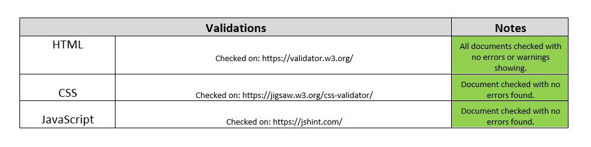
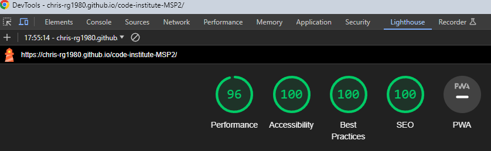
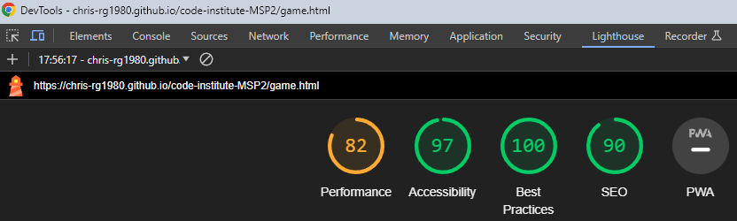
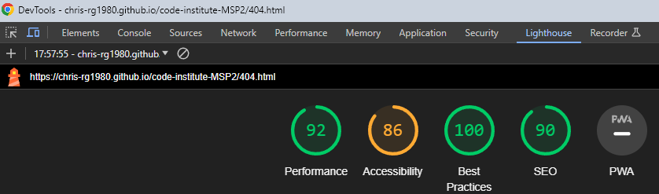
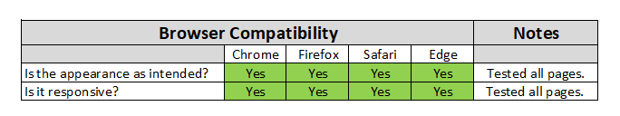

# The Matching Games - Testing

***
**Contents**
- [The Matching Games - Testing](#the-matching-games---testing)
  - [Responsiveness](#responsiveness)
    - [Mobile Screenshots](#mobile-screenshots)
    - [Tablet Screenshots](#tablet-screenshots)
    - [Desktop Screenshots](#desktop-screenshots)
    - [Summary](#summary)
  - [Automated Testing](#automated-testing)
    - [Jest Testing](#jest-testing)
      - [Results](#results)
    - [W3C Validator](#w3c-validator)
    - [JSHint](#jshint)
    - [Validation Summary](#validation-summary)
    - [Lighthouse](#lighthouse)
    - [Wave](#wave)
  - [Browser Compatibility](#browser-compatibility)
  - [Manual Testing](#manual-testing)
    - [Testing User Stories](#testing-user-stories)
      - [New User](#new-user)
      - [Returning User](#returning-user)
    - [Full Testing](#full-testing)
      - [Interactive Elements](#interactive-elements)
  - [Bugs](#bugs)
    - [Solved Bugs](#solved-bugs)
    - [Known Bugs](#known-bugs)

***
## Responsiveness
This website has been tested on a wide range of screen sizes from various manufacturers to account for the differences between them. It’s crucial to test website responsiveness due to the growing use of mobile devices. A responsive website guarantees a uniform user experience across different screen sizes and resolutions, making it easy for visitors to access and navigate the site, regardless of the device they’re using. Additionally, responsive design enhances search engine optimization (SEO), as search engines prioritize mobile-friendly sites in their rankings.

The resolutions tested as as follows:                        
Galaxy S III: 360 x 640                               
Iphone SE: 375 x 667                                  
Iphone 12 Pro: 390 x 844                           
Moto G Power: 412 x 823                                                             
Ipad: 768 x 1024                                                                   
Nexus 10: 800 x 1280                                                                
Desktop 1080p: 1920 x 1080                                       

### Mobile Screenshots

### Tablet Screenshots

### Desktop Screenshots

### Summary

***
## Automated Testing
### Jest Testing
Automated testing enhances efficiency and bug detection. It also helps find potential vulnerabilities in your code more quickly and easily than manual testing.
In development of this project, I decided to Jest test memorygame.js using the unit testing approach. After researching through online documents and YouTube tutorials I found that this form of testing would allow for the testing of specific code to ensure each element of the JavaScript was working correctly.                                     
#### Results
                                                     

### W3C Validator
Testing has been completed using the W3C code validators to ensure that the code used is clean, consistent and adheres to best practices. No warnings or error were found and the results can be found below.                           

[Home Page Validation](/resources/testing/index-validation.png)                       
[Game Page Validation](/resources/testing/game-page-validation.png)                                      
[404 Page Validation](/resources/testing/error-page-validation.png)                                          
[CSS Validation](/resources/testing/css-validation.png)                                         

### JSHint   
Quality testing of the JavaScript code has been carried out using [JSHint](https://jshint.com/). Before testing please ensure the checkboxes next to "New JavaScript features (ES6)" and "jQuery" have been turned on. To do this please click "CONFIGURE" and if needed click "New JavaScript features (ES6)" and "jQuery".                                         

While testing memorygame.js a warning appeared stating "Class properties must be methods. Expected '(' but instead saw '='". After researching online I found that the warning was displayed as I had set the variables outside of the constructor. Once the variables had been moved to inside the constructor the warning is no longer visible. The results are shown below.                                          

**_memorygame.js_**                                                                                

**_script.js_**                                                                                         
                                                 
The two undefined variables are due to them being held in files separate to script.js                                        

**_timer.js_**                                                         
                                               
The one unused variable is due to the timer being used within script.js

### Validation Summary                      

***
### Lighthouse
The lighthouse results can be found for each page below.                                    

**_Home Page_**                                 

                                      

**_Game Page_**                                

                                  

**_404 Page_**                                              

***
### Wave

***
## Browser Compatibility
Testing has been carried out on the browsers within the below table as these browsers are most used, but in addition to this Firefox uses Gecko rendering engine while the others use WebKit. This helps identify any inconsistencies or rendering discrepancies that may arise due to variations in the rendering engines.             

***
## Manual Testing
### Testing User Stories
#### New User
| Goals | How they are achieved |
| :-----| :--------------------:|

#### Returning User
| Goals | How they are achieved |
| :---- | :--------------------:|

***
### Full Testing
#### Interactive Elements
**Header**
| Feature | Expected Outcome | Testing Performed | Result | Pass/Fail |
| :-----: | :--------------: | :---------------: | :----: | :-------: |

**Footer** 
| Feature | Expected Outcome | Testing Performed | Result | Pass/Fail |
| :-----: | :--------------: | :---------------: | :----: | :-------: | 

**Home Page** 
| Feature | Expected Outcome | Testing Performed | Result | Pass/Fail |
| :-----: | :--------------: | :---------------: | :----: | :-------: |

**Game Page** 
| Feature | Expected Outcome | Testing Performed | Result | Pass/Fail |
| :-----: | :--------------: | :---------------: | :----: | :-------: |

**404 Page** 
| Feature | Expected Outcome | Testing Performed | Result | Pass/Fail |
| :-----: | :--------------: | :---------------: | :----: | :-------: |

***
## Bugs
### Solved Bugs
| Bug | Solution |
|:----| :------: |

### Known Bugs
| Page | Bug |
| :--- | :-----: |

***