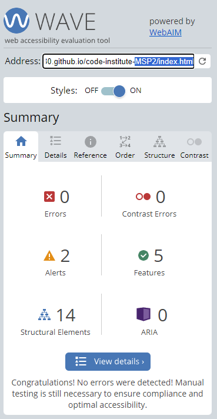
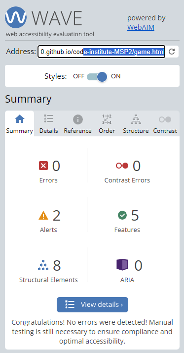
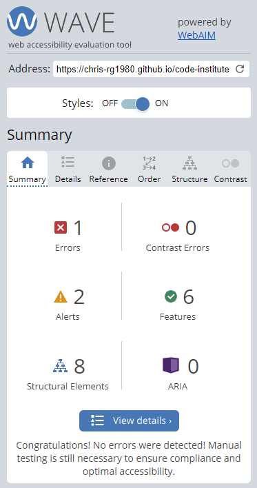
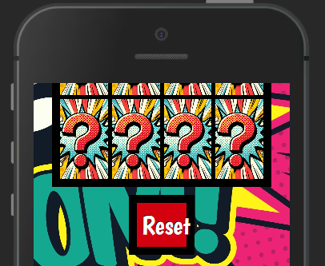

# The Matching Games - Testing

***
**Contents**
- [The Matching Games - Testing](#the-matching-games---testing)
  - [Responsiveness](#responsiveness)
    - [Mobile Screenshots](#mobile-screenshots)
    - [Tablet Screenshots](#tablet-screenshots)
    - [Desktop Screenshots](#desktop-screenshots)
    - [Summary](#summary)
  - [Automated Testing](#automated-testing)
    - [Jest Testing](#jest-testing)
      - [Results](#results)
    - [W3C Validator](#w3c-validator)
    - [JSHint](#jshint)
    - [Validation Summary](#validation-summary)
    - [Lighthouse](#lighthouse)
    - [Wave](#wave)
  - [Browser Compatibility](#browser-compatibility)
  - [Manual Testing](#manual-testing)
    - [Testing User Stories](#testing-user-stories)
      - [New User](#new-user)
      - [Returning User](#returning-user)
    - [Full Testing](#full-testing)
      - [Interactive Elements](#interactive-elements)
  - [Bugs](#bugs)
    - [Solved Bugs](#solved-bugs)
    - [Known Bugs](#known-bugs)

***
## Responsiveness
This website has been tested on a wide range of screen sizes from various manufacturers to account for the differences between them. It’s crucial to test website responsiveness due to the growing use of mobile devices. A responsive website guarantees a uniform user experience across different screen sizes and resolutions, making it easy for visitors to access and navigate the site, regardless of the device they’re using. Additionally, responsive design enhances search engine optimization (SEO), as search engines prioritize mobile-friendly sites in their rankings.

The resolutions tested as as follows:                        
Galaxy S III: 360 x 640                               
Iphone SE: 375 x 667                                  
Iphone 12 Pro: 390 x 844                           
Moto G Power: 412 x 823                                                             
Ipad: 768 x 1024                                                                   
Nexus 10: 800 x 1280                                                                
Desktop 1080p: 1920 x 1080                                       

### Mobile Screenshots

### Tablet Screenshots

### Desktop Screenshots

### Summary

***
## Automated Testing
### Jest Testing
Automated testing enhances efficiency and bug detection. It also helps find potential vulnerabilities in your code more quickly and easily than manual testing.
In development of this project, I decided to Jest test memorygame.js using the unit testing approach. After researching through online documents and YouTube tutorials I found that this form of testing would allow for the testing of specific code to ensure each element of the JavaScript was working correctly. Also as seen below, I have achieved 100% coverage of memorygame.js                                  
#### Results
                                                     

### W3C Validator
Testing has been completed using the W3C code validators to ensure that the code used is clean, consistent and adheres to best practices. No warnings or error were found and the results can be found below.                           

[Home Page Validation](/resources/testing/index-validation.png)                       
[Game Page Validation](/resources/testing/game-page-validation.png)                                      
[404 Page Validation](/resources/testing/error-page-validation.png)                                          
[CSS Validation](/resources/testing/css-validation.png)                                         

### JSHint   
Quality testing of the JavaScript code has been carried out using [JSHint](https://jshint.com/). Before testing please ensure the checkboxes next to "New JavaScript features (ES6)" and "jQuery" have been turned on. To do this please click "CONFIGURE" and if needed click "New JavaScript features (ES6)" and "jQuery".                                         

While testing memorygame.js a warning appeared stating "Class properties must be methods. Expected '(' but instead saw '='". After researching online I found that the warning was displayed as I had set the variables outside of the constructor. Once the variables had been moved to inside the constructor the warning is no longer visible. The results are shown below.                                          

**_memorygame.js_**                                                                                

**_script.js_**                                                                                         
                                                 
The two undefined variables are due to them being held in files separate to script.js                                        

**_timer.js_**                                                         
                                               
The one unused variable is due to the timer being used within script.js

### Validation Summary                      

***
### Lighthouse
The lighthouse results can be found for each page below.                                    

**_Home Page_**                                 

                                      

**_Game Page_**                                

                                  

**_404 Page_**                                              

***
### Wave
Currently, the Wave Tool has detected an error on the 404 page. This error is a result of the automatic redirection to the home page. While the redirection feature provides a valuable user experience, it triggers an issue with the Wave Tool's evaluation.                                                               

The automatic redirection function adds significant value to our users, by automatically redirecting them to the home page without requiring any additional input. This will enhance the overall convenience and efficiency of their browsing experience.                                                                            

**_Home Page_**                                                                                   

                                              

**_Game Page_**                                                                 

                                                             

**_404 Page_**                                                  

***
## Browser Compatibility
Testing has been carried out on the browsers within the below table as these browsers are most used, but in addition to this Firefox uses Gecko rendering engine while the others use WebKit. This helps identify any inconsistencies or rendering discrepancies that may arise due to variations in the rendering engines.             

***
## Manual Testing
### Testing User Stories
#### New User
| Goals | How they are achieved |
| :-----| :--------------------:|
|I would like to see how fast I can complete the game. | The game contains a timer that starts counting when the player makes their first click. |
|I would like to know how many moves it took me to complete the game. | The game contains a guess box which counts and displays the total moves a player takes to complete the game. |
|I would like to know how to play the picture matching games. | The home page contains a list of instructions. |

#### Returning User
| Goals | How they are achieved |
| :---- | :--------------------:|
|I would like to be able to reset the game and aim for faster times. | There is a rest button under the game which can be used at any time during or after the game has finished. |
|I would like to see if I can complete the game with less moves. | The player can use the guess box which will show them the number of moves taken and the player can then play the game again to try to lower that score. |
|I would like to be able to play the game across on different devices. | The game is fully responsive and can be played across different devices. |
***
### Full Testing
#### Interactive Elements
**Header**
| Feature | Expected Outcome | Testing Performed | Result | Pass/Fail |
| :-----: | :--------------: | :---------------: | :----: | :-------: |
|Clicking on any part of the header will return the user to the home page. | When clicked the user will be returned to the home page. | Clicked on header. | Returned to home page. | Pass |

**Footer** 
| Feature | Expected Outcome | Testing Performed | Result | Pass/Fail |
| :-----: | :--------------: | :---------------: | :----: | :-------: | 
|Home page link | When clicked the user will be returned to the home page. | Clicked on home page link. | Redirected to home page.| Pass |
|Matching Marvel link | When clicked this will take the user to the Matching Marvel game. | Clicked on Matching Marvel link. | Redirected to Matching Marvel game. | Pass |
|Social Media Icons | When clicked these will take the user to the respective website. | Clicked on all Social Media Icons. | Redirected to the respective websites. | Pass | 

**Home Page** 
| Feature | Expected Outcome | Testing Performed | Result | Pass/Fail |
| :-----: | :--------------: | :---------------: | :----: | :-------: |
|Matching Marvel game selector | When clicked this will take the user to the Matching Marvel game. | Clicked on Matching Marvel link. | Redirected to Matching Marvel game. | Pass |

**Game Page** 
| Feature | Expected Outcome | Testing Performed | Result | Pass/Fail |
| :-----: | :--------------: | :---------------: | :----: | :-------: |
|Game Grid | When the game will start and the respective image will show. | Clicked on game grid. | Game started with timer and scores. All respective images are shown. | Pass |
|Reset Button | When clicked the game will reset. | Clicked on reset button. | The game was reset with all game images hidden. | Pass |

**404 Page** 
| Feature | Expected Outcome | Testing Performed | Result | Pass/Fail |
| :-----: | :--------------: | :---------------: | :----: | :-------: |
|Home page redirection | When the 404 page is displayed the user will automatically be redirected to the home page after 30 seconds. | Displayed 404 page. | Redirected to home page after 30 seconds. | Pass |
***
## Bugs
### Solved Bugs
| Bug | Solution |
|:----| :------: |
|The initial chosen background image would not scale to cover the total viewport. | The background image was changed to a repeating pattern background image which allows it to scale. |
|During testing the responsiveness of the website, the reset button would not scale correctly leaving the word "reset" to escape the box.   | To combat this the width of the reset button was changed to 35%. |
|After manual testing te game I found that the game array would not randomise when the reset button was pressed. | Adding the start function to the resetGame function in scripts.js would call a new instance of that game and randomise the array. |

### Known Bugs
| Page | Bug |
| :--- | :-----: |
| 404 Page | Currently, the Wave Tool has detected an error on the 404 page. This error is a result of the automatic redirection to the home page. While the redirection feature provides a valuable user experience, it triggers an issue with the Wave Tool's evaluation. |

***